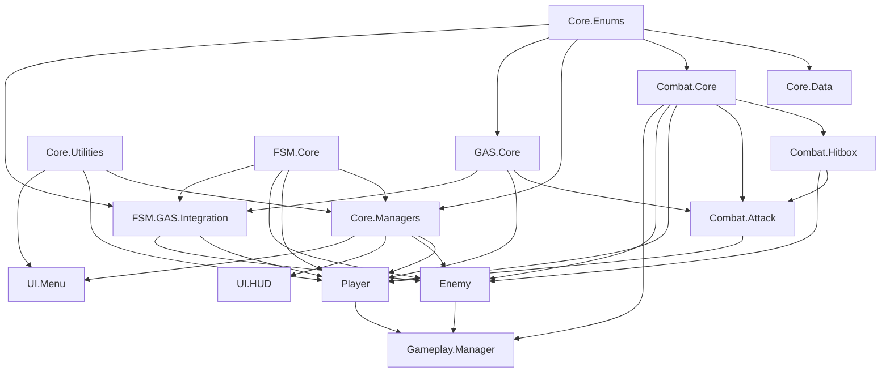

# GASPT 어셈블리 아키텍처 가이드

## 📋 개요

이 문서는 GASPT 프로젝트의 어셈블리 참조 구조를 정의하고, **순환 참조를 방지**하기 위한 가이드입니다.

**작성일**: 2025-10-13
**최종 업데이트**: 2025-10-13

---

## 🎯 핵심 원칙

### 1. 계층적 참조 (Layered Reference)
- **낮은 레이어는 높은 레이어를 절대 참조할 수 없음**
- 같은 레이어 내에서는 신중하게 참조
- 상위 레이어는 하위 레이어를 자유롭게 참조 가능

### 2. 순환 참조 방지 전략
1. **동적 타입 검색 (Reflection)**: 컴파일 타임 참조 제거
2. **인터페이스/이벤트**: 느슨한 결합
3. **어셈블리 분할**: 책임 명확히 분리

### 3. 명명 규칙
- **Core.XXX**: 핵심 시스템
- **Combat.XXX**: 전투 관련
- **UI.XXX**: 사용자 인터페이스
- **Gameplay.XXX**: 게임플레이 로직
- **Tests.XXX** / **XXX.Demo**: 테스트 코드

---

## 🏗️ 어셈블리 계층 구조

```
Layer 0 (Foundation) - 최하위, 모두가 참조 가능
├─ Core.Enums
└─ Core.Utilities

Layer 1 (Data)
└─ Core.Data → Core.Enums

Layer 2 (Plugins) - 외부 플러그인
├─ FSM.Core
└─ GAS.Core

Layer 3 (Core Systems & Integration)
├─ FSM.GAS.Integration → FSM.Core, GAS.Core, Core.Enums
├─ Combat.Core → Core.Enums
└─ Core.Managers → FSM.Core, Core.Utilities, Core.Enums, Core.Data

Layer 4 (Combat Extended)
├─ Combat.Hitbox → Combat.Core, Core.Enums
└─ Combat.Attack → Combat.Core, Combat.Hitbox, GAS.Core, Core.Enums

Layer 5 (Gameplay Entities)
├─ Player → FSM.Core, GAS.Core, Combat.Core, Combat.Attack, Core.Enums, Core.Managers, Core.Utilities
├─ Enemy → FSM.Core, Combat.Core, Combat.Hitbox, Core.Enums, Core.Managers
└─ Skull → GAS.Core, FSM.Core, Player

Layer 6 (High-level Systems)
├─ Gameplay.Manager → Player, Enemy, Combat.Core, Core.Utilities
├─ UI.HUD → Core.Managers, Core.Utilities, Combat.Core
└─ UI.Menu → Core.Managers, Core.Enums, Core.Utilities

Layer 7 (Testing) - 최상위, 모든 것을 참조 가능
├─ Tests → (모든 어셈블리 참조 가능)
├─ Combat.Demo → (모든 어셈블리 참조 가능)
└─ Combat.Tests.Unit → (모든 어셈블리 참조 가능)

Layer 8 (Editor)
└─ Editor → (Unity Editor 전용)
```

---

## 📊 어셈블리 참조 매트릭스

### Layer 0: Foundation

| 어셈블리 | 참조 | 설명 |
|---------|------|------|
| **Core.Enums** | (없음) | 모든 Enum 정의 |
| **Core.Utilities** | (없음) | 유틸리티 클래스 (Singleton 등) |

### Layer 1: Data

| 어셈블리 | 참조 | 설명 |
|---------|------|------|
| **Core.Data** | Core.Enums | ScriptableObject 기반 데이터 |

### Layer 2: Plugins

| 어셈블리 | 참조 | 설명 |
|---------|------|------|
| **FSM.Core** | (독립) | Finite State Machine |
| **GAS.Core** | Core.Enums | Gameplay Ability System |

### Layer 3: Core Systems & Integration

| 어셈블리 | 참조 | 설명 |
|---------|------|------|
| **FSM.GAS.Integration** | FSM.Core, GAS.Core, Core.Enums | FSM과 GAS 통합 (AbilityState, AbilityCondition 등) |
| **Combat.Core** | Core.Enums | 전투 핵심 (DamageSystem, HealthSystem) |
| **Core.Managers** | FSM.Core, Core.Utilities, Core.Enums, Core.Data | 게임 관리자 (GameFlow, SceneLoader) |

### Layer 4: Combat Extended

| 어셈블리 | 참조 | 설명 |
|---------|------|------|
| **Combat.Hitbox** | Combat.Core, Core.Enums | 히트박스/허트박스 |
| **Combat.Attack** | Combat.Core, Combat.Hitbox, GAS.Core, Core.Enums | 공격 시스템 |

### Layer 5: Gameplay Entities

| 어셈블리 | 참조 | 설명 |
|---------|------|------|
| **Player** | FSM.Core, GAS.Core, Combat.Core, Combat.Attack, Core.Enums, Core.Managers, Core.Utilities | 플레이어 컨트롤러 |
| **Enemy** | FSM.Core, Combat.Core, Combat.Hitbox, Core.Enums, Core.Managers | 적 AI |
| **Skull** | GAS.Core, FSM.Core, Player | Skull 시스템 |

### Layer 6: High-level Systems

| 어셈블리 | 참조 | 설명 |
|---------|------|------|
| **Gameplay.Manager** | Player, Enemy, Combat.Core, Core.Utilities | Gameplay 씬 관리 |
| **UI.HUD** | Core.Managers, Core.Utilities, Combat.Core | HUD (체력바, 아이템 슬롯) |
| **UI.Menu** | Core.Managers, Core.Enums, Core.Utilities | 메뉴 UI (Main, Loading) |

---

## ⚠️ 순환 참조 위험 지역

### 1. Core.Managers ↔ UI.Menu
**문제**:
- `Core.Managers` → `UI.Menu` (GameState에서 LoadingUI 사용)
- `UI.Menu` → `Core.Managers` (MainMenuUI에서 GameFlowManager 사용)

**해결**:
- Core.Managers는 UI.Menu를 직접 참조하지 않음
- 동적 타입 검색 (Reflection) 사용
```csharp
var loadingUIType = System.Type.GetType("UI.Menu.LoadingUI, UI.Menu");
var loadingUI = uiObject.AddComponent(loadingUIType) as MonoBehaviour;
```

### 2. Core.Managers ↔ Player/Enemy
**문제**:
- `Player/Enemy` → `Core.Managers` (SceneLoader, GameFlowManager 사용)
- `Core.Managers`가 `Player/Enemy`를 직접 참조하면 순환

**해결**:
- Core.Managers는 Player/Enemy를 직접 참조하지 않음
- Gameplay.Manager (상위 레이어)가 Player/Enemy 관리

### 3. Gameplay.Manager → Player/Enemy
**상태**: ✅ **안전** (상위 → 하위 참조)

---

## 🛠️ 어셈블리 추가/수정 가이드

### 새 어셈블리 추가 시

1. **레이어 결정**
   - 이 어셈블리는 어느 레이어에 속하는가?
   - 어떤 어셈블리들을 참조해야 하는가?

2. **참조 검증**
   - 참조하려는 어셈블리가 같은 레이어거나 더 낮은 레이어인가?
   - 순환 참조가 발생하지 않는가?

3. **명명 규칙 준수**
   - 네임스페이스와 어셈블리 이름 일치
   - 명확한 책임 분리

### 참조 추가 시 체크리스트

```
□ 참조하려는 어셈블리가 더 낮은 레이어인가?
□ 역참조가 없는가? (A → B일 때, B → A 없음)
□ 같은 레이어 내 참조는 최소화했는가?
□ 순환 참조 경로가 없는가?
```

### 순환 참조 발생 시 해결 방법

**Option 1: 동적 타입 검색 (Reflection)**
```csharp
// 직접 참조 대신
var type = System.Type.GetType("Namespace.ClassName, AssemblyName");
var component = gameObject.AddComponent(type);
```

**Option 2: 인터페이스 분리**
```csharp
// Core.Interfaces (새 어셈블리)
public interface ISceneLoader { void LoadScene(SceneType type); }

// Core.Managers
public class SceneLoader : ISceneLoader { ... }

// 사용하는 쪽
ISceneLoader sceneLoader = FindAnyObjectByType<ISceneLoader>();
```

**Option 3: 이벤트 시스템**
```csharp
// Core.Events (새 어셈블리)
public static class GameEvents
{
    public static event Action<SceneType> OnSceneLoadRequested;
}

// UI에서
GameEvents.OnSceneLoadRequested?.Invoke(SceneType.Gameplay);

// Core.Managers에서
GameEvents.OnSceneLoadRequested += LoadScene;
```

---

## 📈 의존성 그래프



---

## ✅ 성공 기준

### 컴파일 타임
- ✅ 순환 참조 에러 없음
- ✅ 모든 어셈블리 정상 빌드
- ✅ Unity Editor에서 에러 없음

### 런타임
- ✅ 동적 타입 검색 성공
- ✅ 모든 시스템 정상 동작
- ✅ 성능 저하 없음

### 유지보수
- ✅ 명확한 계층 구조
- ✅ 쉬운 확장성
- ✅ 문서화 완료

---

## 🔍 문제 해결

### "Circular dependency detected" 에러

**증상**: Unity 컴파일 시 순환 참조 에러

**해결 단계**:
1. 에러 메시지에서 순환 경로 확인 (A → B → C → A)
2. 이 문서의 "순환 참조 위험 지역" 섹션 참조
3. 위 3가지 해결 방법 중 하나 적용
4. 어셈블리 참조 제거 후 재컴파일

### 동적 타입 검색 실패

**증상**: `Type.GetType()` 반환값이 null

**원인**:
- 어셈블리 이름 오타
- 네임스페이스 불일치

**해결**:
```csharp
// 올바른 형식: "Namespace.ClassName, AssemblyName"
var type = System.Type.GetType("UI.Menu.LoadingUI, UI.Menu");

// 디버깅
if (type == null)
{
    Debug.LogError($"타입을 찾을 수 없습니다: UI.Menu.LoadingUI");
    // 모든 어셈블리 검색
    var assemblies = System.AppDomain.CurrentDomain.GetAssemblies();
    foreach (var assembly in assemblies)
    {
        var foundType = assembly.GetType("UI.Menu.LoadingUI");
        if (foundType != null)
        {
            Debug.Log($"발견: {assembly.FullName}");
        }
    }
}
```

---

## 📚 참고 문서

- **.spec/architecture.yaml**: 시스템 아키텍처
- **docs/development/CurrentStatus.md**: 프로젝트 현황
- **Unity Manual**: [Assembly Definitions](https://docs.unity3d.com/Manual/ScriptCompilationAssemblyDefinitionFiles.html)

---

## 🎯 다음 단계

### Phase 1: 현재 구조 안정화 ✅
- [x] 어셈블리 계층 구조 문서화
- [x] 순환 참조 제거
- [x] 동적 타입 검색 적용

### Phase 2: 인터페이스 분리 (선택 사항)
- [ ] Core.Interfaces 어셈블리 생성
- [ ] 주요 Manager 인터페이스 추출
- [ ] Reflection → Interface로 전환

### Phase 3: 이벤트 시스템 (선택 사항)
- [ ] Core.Events 어셈블리 생성
- [ ] 이벤트 기반 통신으로 전환
- [ ] 느슨한 결합 강화

---

**작성**: GASPT 개발팀 + Claude Code
**버전**: 1.0
**라이선스**: Internal Use Only
