# GASPT 아키텍처 다이어그램

> Mermaid 다이어그램으로 시각화한 프로젝트 구조

**Note**: 이 문서는 GitHub, GitLab, Visual Studio Code (Markdown Preview Enhanced) 등에서 Mermaid 렌더링을 지원합니다.

## 📋 목차
1. [전체 시스템 아키텍처](#전체-시스템-아키텍처)
2. [레이어 의존성 다이어그램](#레이어-의존성-다이어그램)
3. [GameFlow 상태 다이어그램](#gameflow-상태-다이어그램)
4. [씬 전환 시퀀스](#씬-전환-시퀀스)
5. [UI 시스템 구조](#ui-시스템-구조)
6. [클래스 다이어그램](#클래스-다이어그램)

---

## 전체 시스템 아키텍처

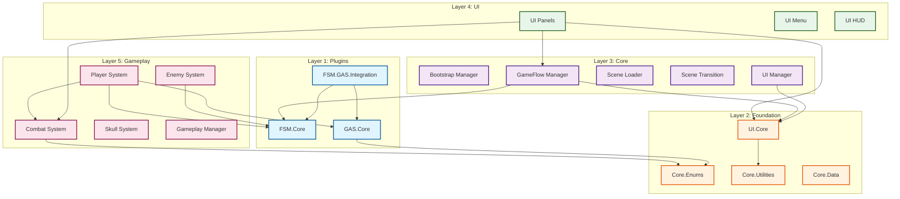

---

## 레이어 의존성 다이어그램

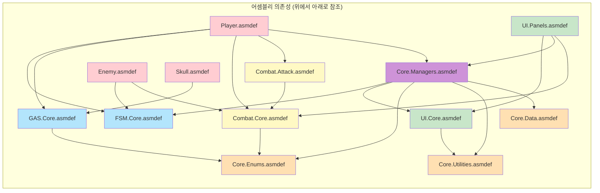

---

## GameFlow 상태 다이어그램

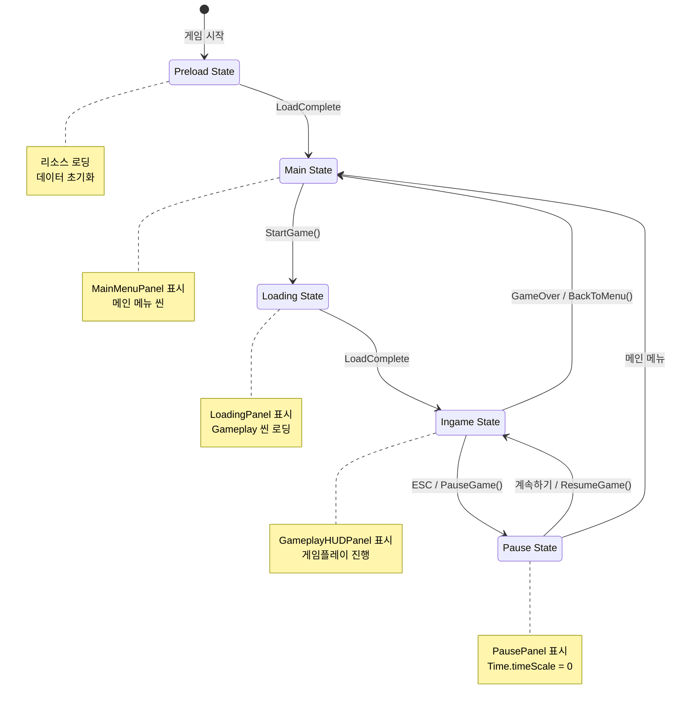

---

## 씬 전환 시퀀스

### Bootstrap → Preload → Main 시퀀스

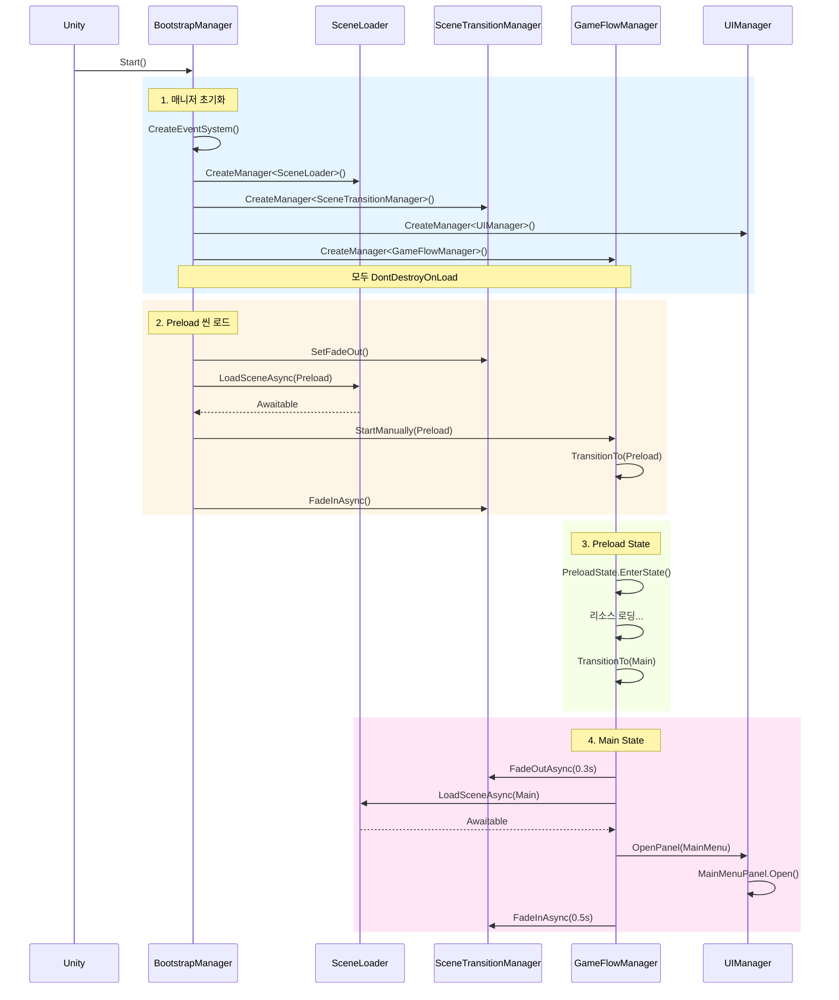

### Main → Loading → Ingame 시퀀스

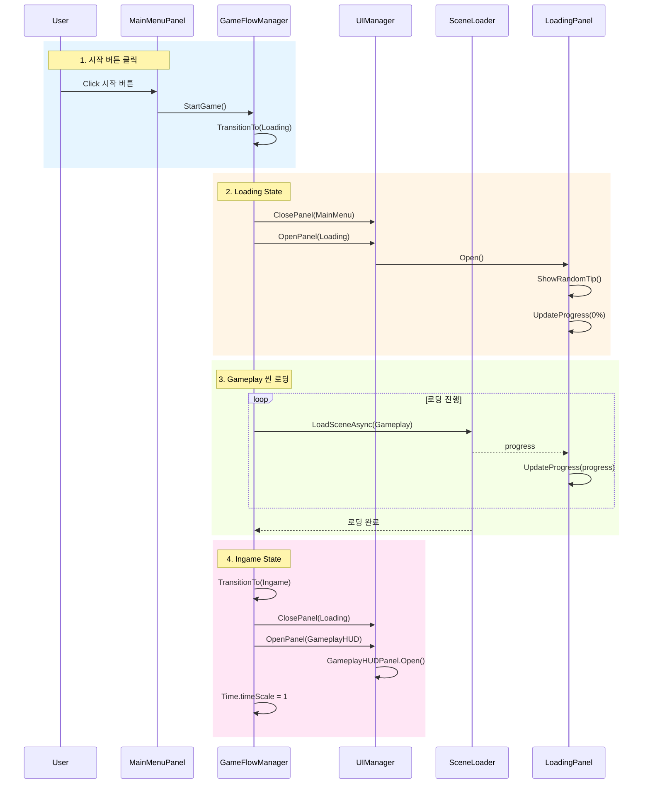

---

## UI 시스템 구조

### Panel 생명주기

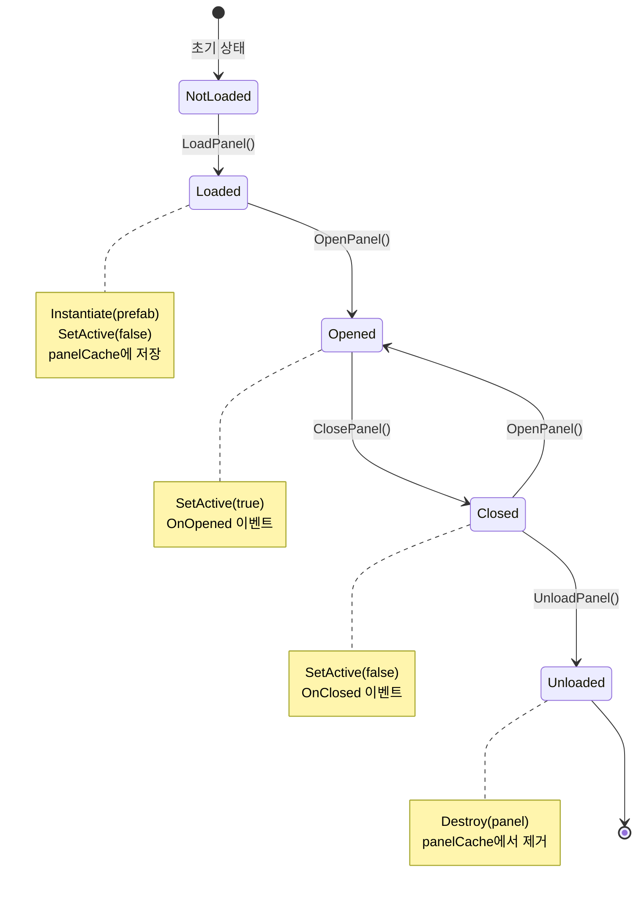

### UIManager 구조

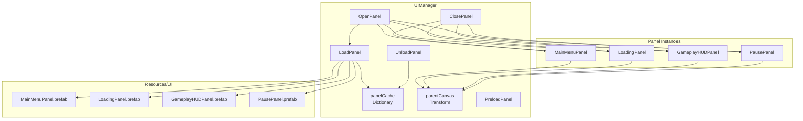

---

## 클래스 다이어그램

### GameFlow 시스템

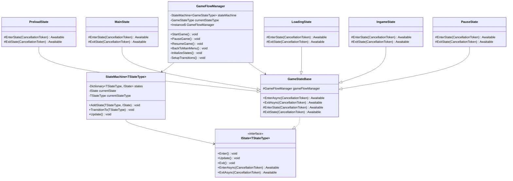

### UI 시스템

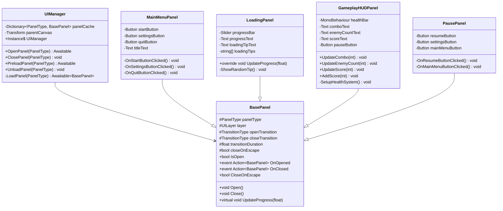

### FSM 시스템

```mermaid
classDiagram
    class IStateMachine~TStateType~ {
        <<interface>>
        +AddState(TStateType, IState) void
        +RemoveState(TStateType) void
        +TransitionTo(TStateType) void
        +AddTransition(TStateType, TStateType, Func~bool~) void
        +Update() void
    }

    class StateMachine~TStateType~ {
        -Dictionary~TStateType, IState~ states
        -IState currentState
        -TStateType currentStateType
        -List~Transition~ transitions
        +AddState(TStateType, IState) void
        +RemoveState(TStateType) void
        +TransitionTo(TStateType) void
        +AddTransition(TStateType, TStateType, Func~bool~) void
        +Update() void
    }

    class IState~TStateType~ {
        <<interface>>
        +Enter() void
        +Update() void
        +Exit() void
        +EnterAsync(CancellationToken) Awaitable
        +ExitAsync(CancellationToken) Awaitable
    }

    class State~TStateType~ {
        +virtual void Enter()
        +virtual void Update()
        +virtual void Exit()
        +virtual Awaitable EnterAsync(CancellationToken)
        +virtual Awaitable ExitAsync(CancellationToken)
    }

    class Transition {
        +TStateType From
        +TStateType To
        +Func~bool~ Condition
    }

    StateMachine~TStateType~ ..|> IStateMachine~TStateType~
    StateMachine~TStateType~ --> IState~TStateType~
    StateMachine~TStateType~ --> Transition

    State~TStateType~ ..|> IState~TStateType~
```

---

## 데이터 흐름 다이어그램

### 게임 시작부터 플레이까지의 데이터 흐름

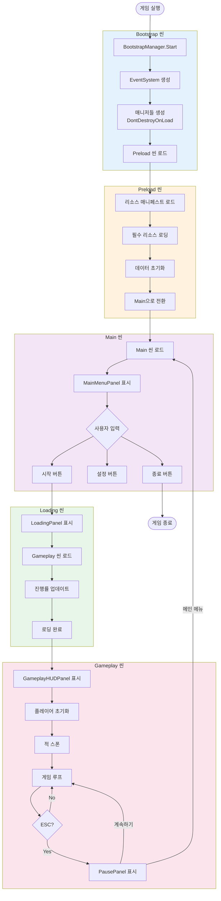

---

## 성능 최적화 포인트

### Panel 로딩 전략

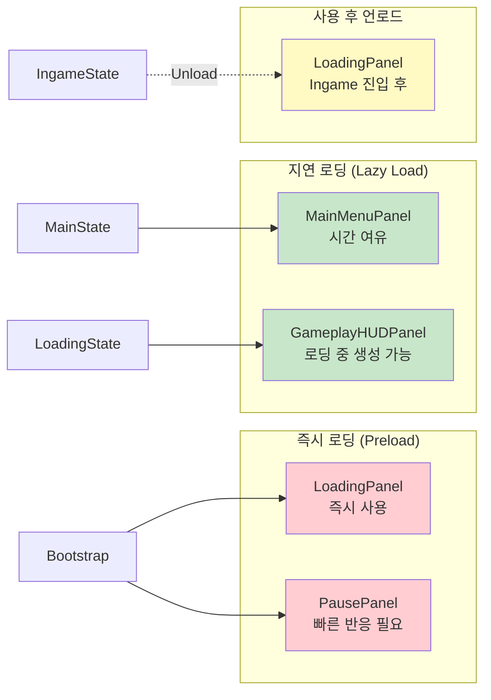

---

**작성일**: 2025-10-15
**버전**: 1.0
**도구**: Mermaid.js

## 다이어그램 렌더링 방법

### VS Code
1. "Markdown Preview Enhanced" 확장 설치
2. Ctrl+Shift+V로 미리보기

### GitHub
- `.md` 파일을 GitHub에 푸시하면 자동 렌더링

### 온라인
- https://mermaid.live/ 에서 코드 복사하여 렌더링
