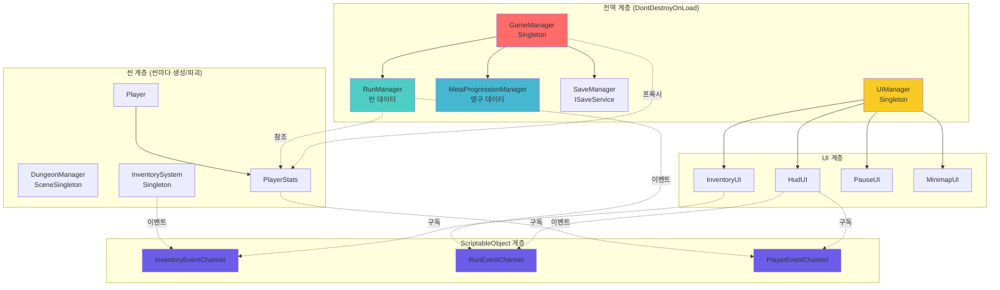
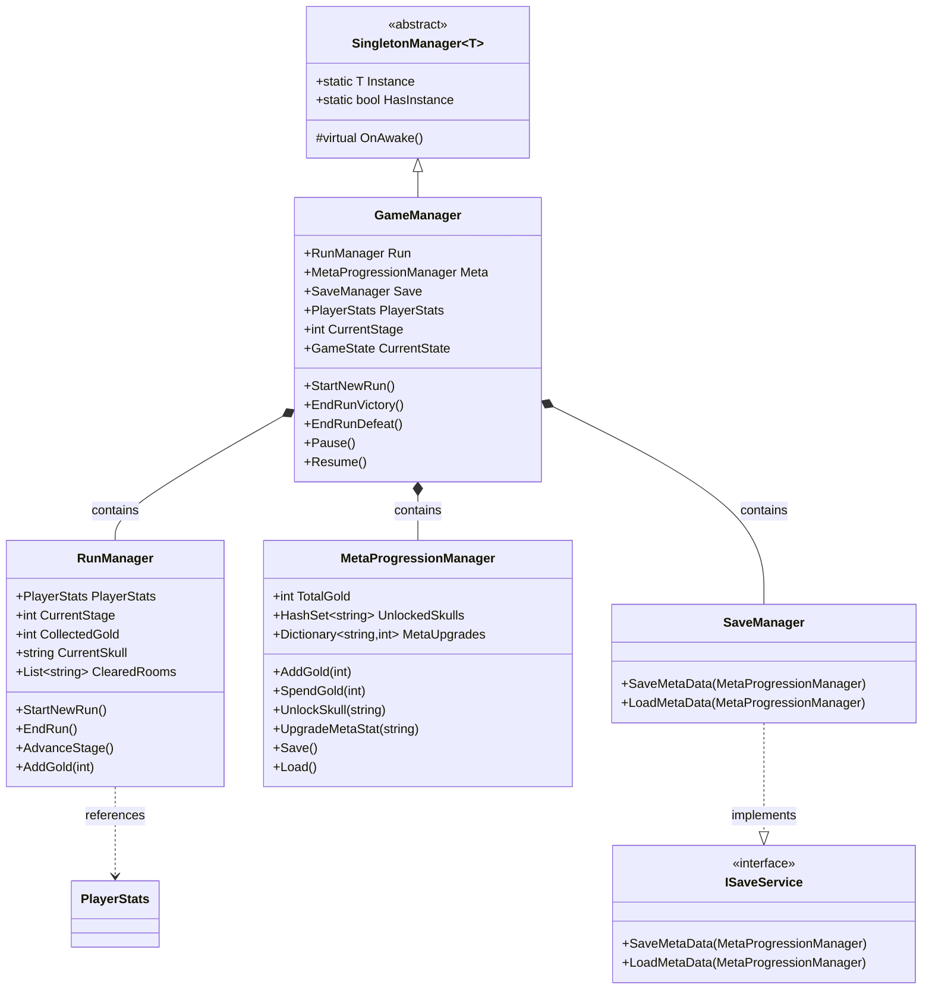
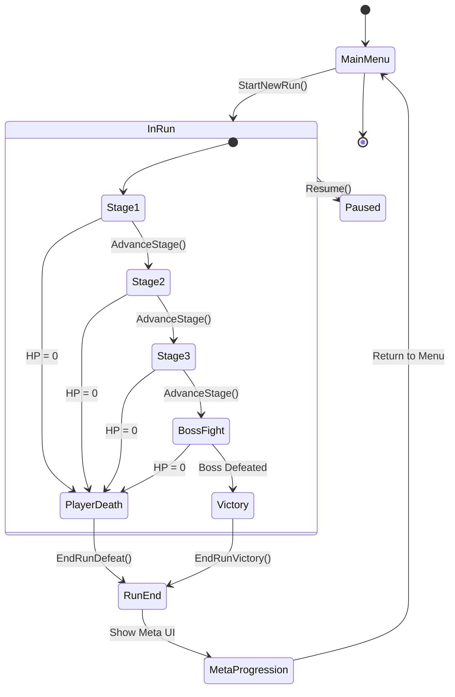
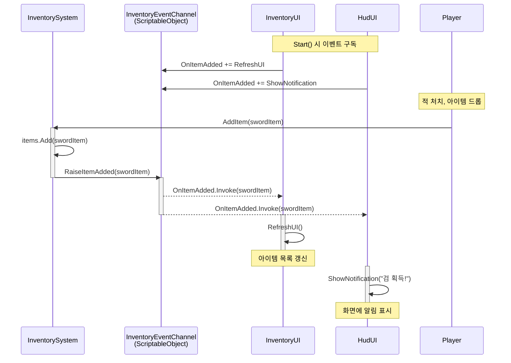
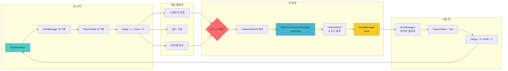
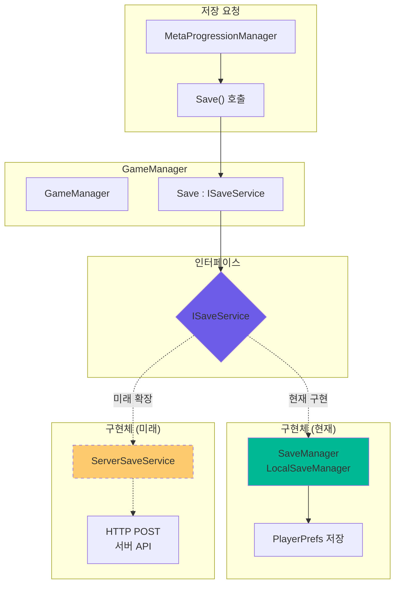

# GASPT 아키텍처 다이어그램

> **목적**: 아키텍처를 시각적으로 이해하기 위한 다이어그램 모음
> **도구**: Mermaid (GitHub, Notion 등에서 렌더링 가능)

---

## 1. 전체 시스템 아키텍처

---

## 2. GameManager 클래스 다이어그램

---

## 3. 런 생명주기 상태 다이어그램

---

## 4. 이벤트 시스템 시퀀스 다이어그램

---

## 5. 데이터 흐름도 (런 vs 메타)

---

## 6. 저장 시스템 구조

---

## 사용 방법

이 다이어그램들은 Mermaid 문법으로 작성되어 다음 도구에서 렌더링할 수 있습니다:

1. **GitHub**: README.md에 직접 삽입
2. **VS Code**: Mermaid Preview 플러그인 설치
3. **Notion**: /code 블록에서 mermaid 선택
4. **온라인**: https://mermaid.live/

포트폴리오 문서에 이미지로 포함하려면:
1. https://mermaid.live/ 에서 코드 붙여넣기
2. SVG/PNG로 다운로드
3. 문서에 이미지 삽입
